AWS Microservices Architecture Guide
🔹 Task Overview
The goal is to design and deploy a highly available, secure, and scalable microservices architecture on AWS. The system consists of:

A frontend hosted on Amazon S3 (static website).

Backend services running on EC2 instances in private subnets.

An authentication service implemented with AWS Lambda.

An Application Load Balancer (ALB) that routes traffic to the correct service based on path rules.

🔹 Objectives
Scalability: Ensure services can handle increasing traffic by using ALB and auto-scaling EC2.

Security: Place EC2 in private subnets, restrict access via security groups, and expose only through ALB.

Availability: Use multiple availability zones and health checks to keep services online.

Separation of concerns: Route requests to different target groups (users, payments, auth) for modularity.

Cost efficiency: Use serverless Lambda for authentication to reduce overhead.

🔹 Step-by-Step Implementation
1. Frontend (S3)
Create bucket www.myapp.com.

Upload index.html and error.html.

Enable Static Website Hosting.

Add Bucket Policy for public read.

Configure CORS to allow API calls.

Test via S3 endpoint.
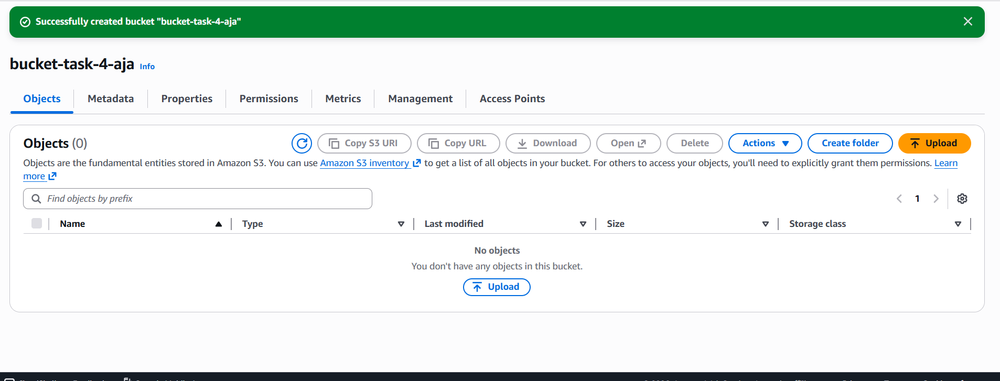
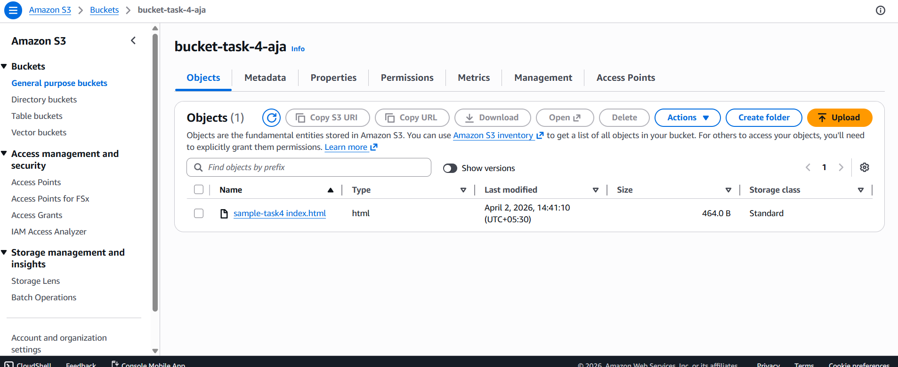
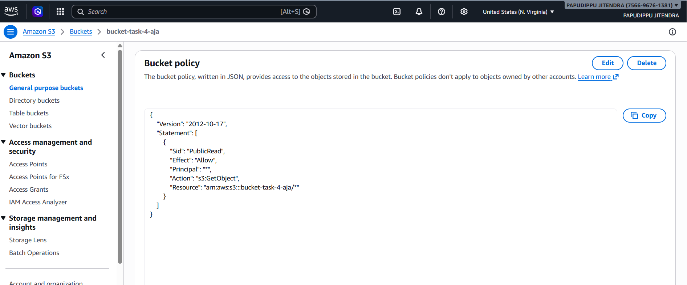
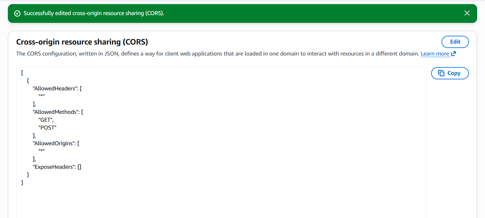

2. Networking (VPC)
Create VPC 10.0.0.0/16.

Public subnets → ALB.

Private subnets → EC2.

Attach Internet Gateway.

Configure route tables:

Public → IGW.

Private → NAT Gateway (optional).
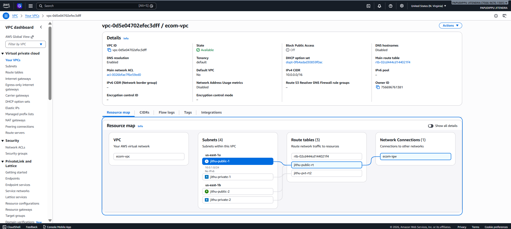

3. EC2 Backend
Launch EC2 in private subnet.

Attach IAM role for SSM.

Connect via Session Manager.

Install runtime (Node.js or Nginx).

Verify with curl localhost.
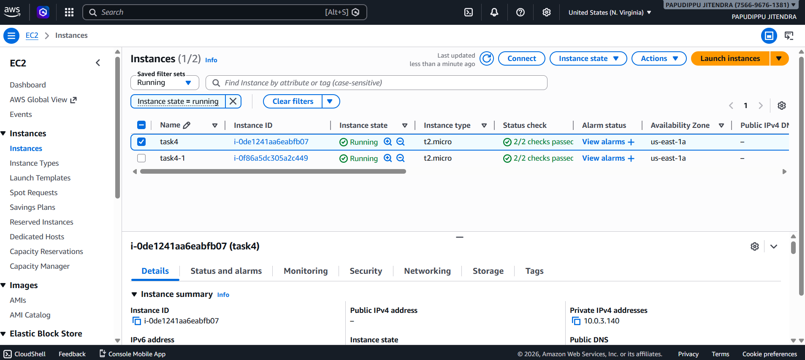
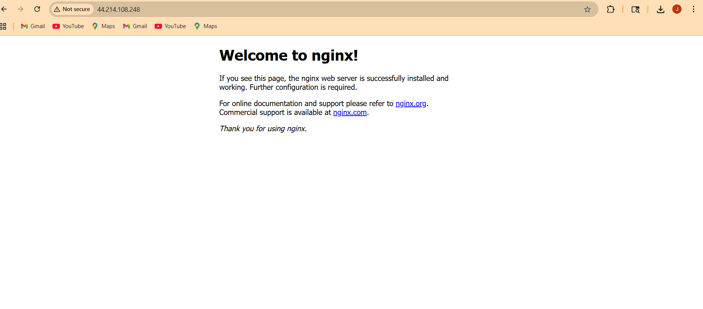

4. Lambda (Authentication)
Create Lambda function (python runtime).

Example code:

js
exports.handler = async (event) => {
  return {
    statusCode: 200,
    body: JSON.stringify({ message: "Auth successful" }),
  };
};
Attach IAM role for logging.

Test in console.
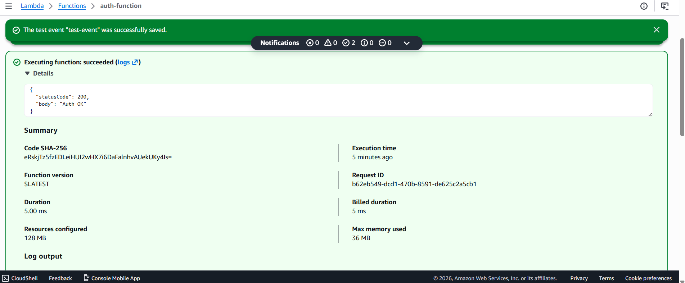

5. Target Groups
Create:

api-ec2-tg → EC2 backend.

payments-ec2-tg → EC2 backend.

auth-lambda-tg → Lambda.

Register instances.

Configure health check path /.
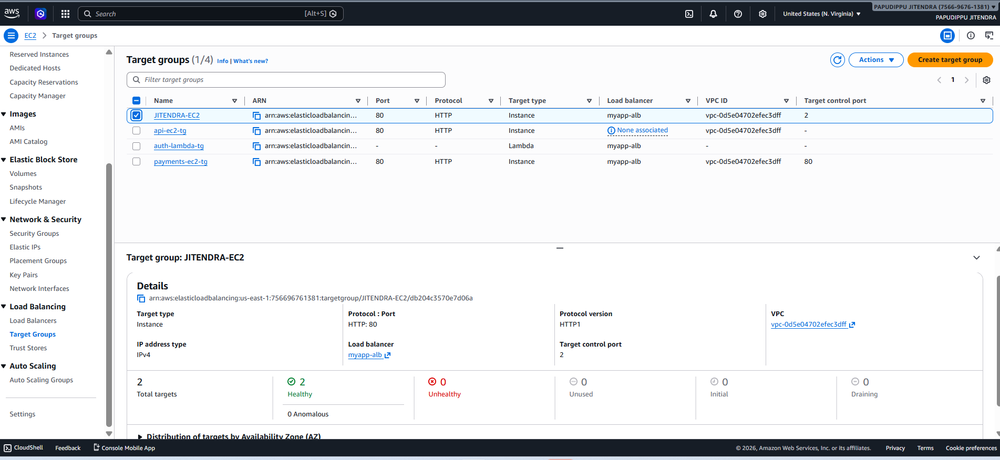

6. Application Load Balancer
Create ALB (Internet-facing).

Attach public subnets.

Security group: allow inbound HTTP/HTTPS.

Add listener on port 80.
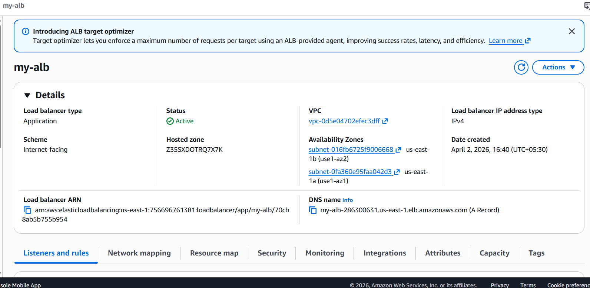

7. Listener Rules
/api/users/* → forward to api-ec2-tg.

/api/payments/* → forward to payments-ec2-tg.

/api/auth/* → forward to auth-lambda-tg.

Default → fallback target group.
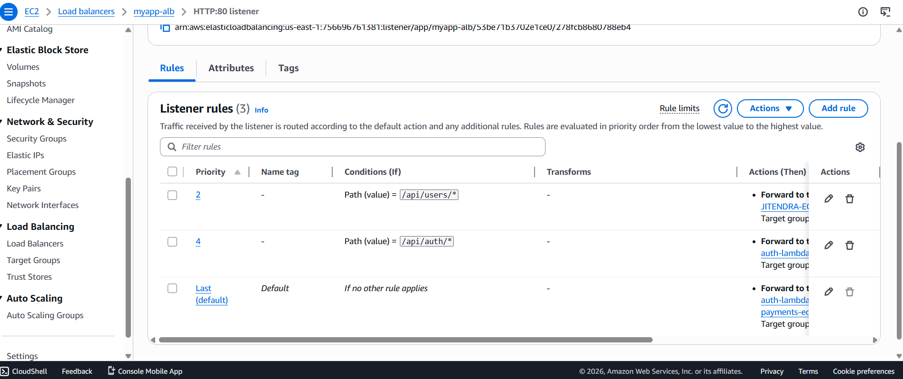

8. Security Groups
ALB SG: allow HTTP/HTTPS from internet.

EC2 SG: allow HTTP from ALB SG only.

Restrict SSH to your IP.

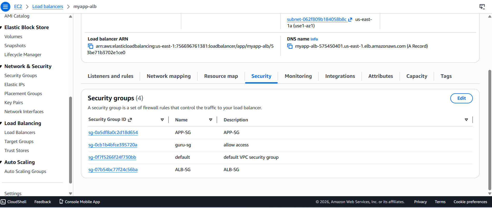
9. Validation
Check target group health = Healthy.

Test endpoints:
Connect Frontend
Update index.html:
fetch("http://YOUR-REAL-ALB-DNS/api/users")
Re-upload to S3

Final Output Website loads from S3 Button → EC2 response Button → Lambda response 🧩 Key Learnings Path-based routing using ALB Integration of EC2 and Lambda Static website hosting with S3 Real-world microservices architecture

bash
curl http://<ALB-DNS>/api/users/
curl http://<ALB-DNS>/api/payments/
curl http://<ALB-DNS>/api/auth/
Frontend (S3) should call APIs via ALB DNS.

🔹 Conclusion
This architecture provides:

High availability through ALB and health checks.

Security by isolating EC2 in private subnets and restricting access.

Scalability with EC2 auto-scaling and serverless Lambda.

Modularity by routing different API paths to separate services.

Cost efficiency by combining EC2 for heavy workloads with Lambda for lightweight authentication.